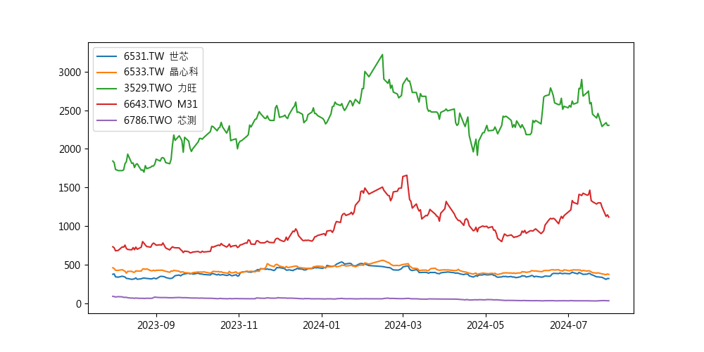

## Introduction(簡介)

這個Python腳本會比較台灣一些指定的股票在過去一年的價格變動。此腳本使用yfinance來獲取股票數據，並使用matplotlib來繪製價格走勢圖。

This Python script compares the price changes of some indicated stocks over the past year. It uses yfinance to fetch stock data and matplotlib to plot the price trends.

## 輸出 (Output)
該腳本將生成一個圖表，顯示每個股票在過去一年中的每日收盤價變動。每條線代表一隻股票。

The script will generate a chart showing the daily closing price changes of each stock over the past year. Each line represents a different stock.

## Author Information

### Name
Curtis Hsu(Ying-Hao Hsu)

### Creation Date
August 1, 2024

### Contact Information
- **Email**: ar06053127hga@hotmail.com.tw
- **GitHub**: [Curtis081](https://github.com/Curtis081)
- **LinkedIn**: [Curtis Hsu(Ying-Hao Hsu)](https://www.linkedin.com/in/yinghaohsu/)

#### Note
For any inquiries or contributions regarding this project, please feel free to contact me through the above channels. If reporting bugs or requesting features, consider opening an issue on GitHub for public tracking and documentation.